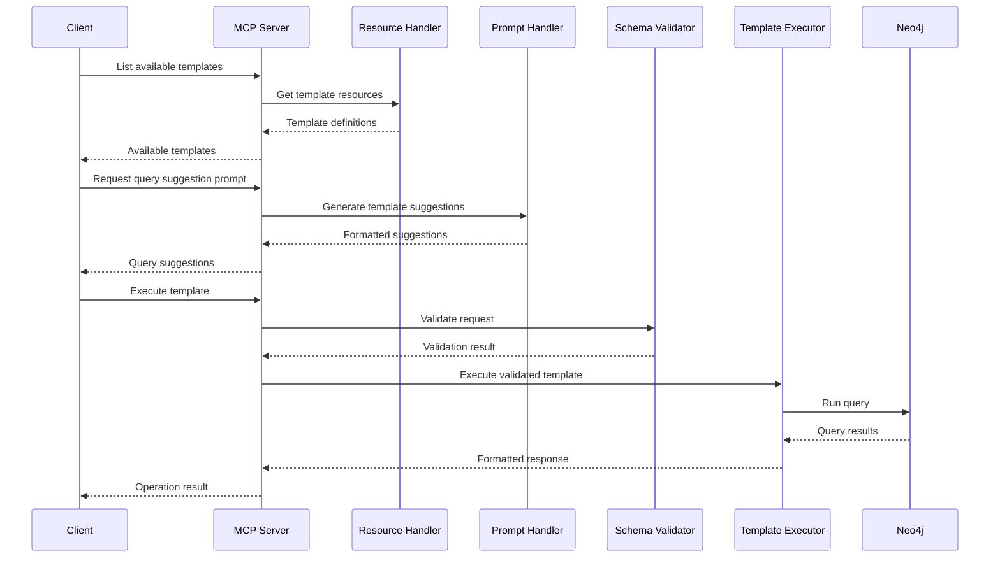
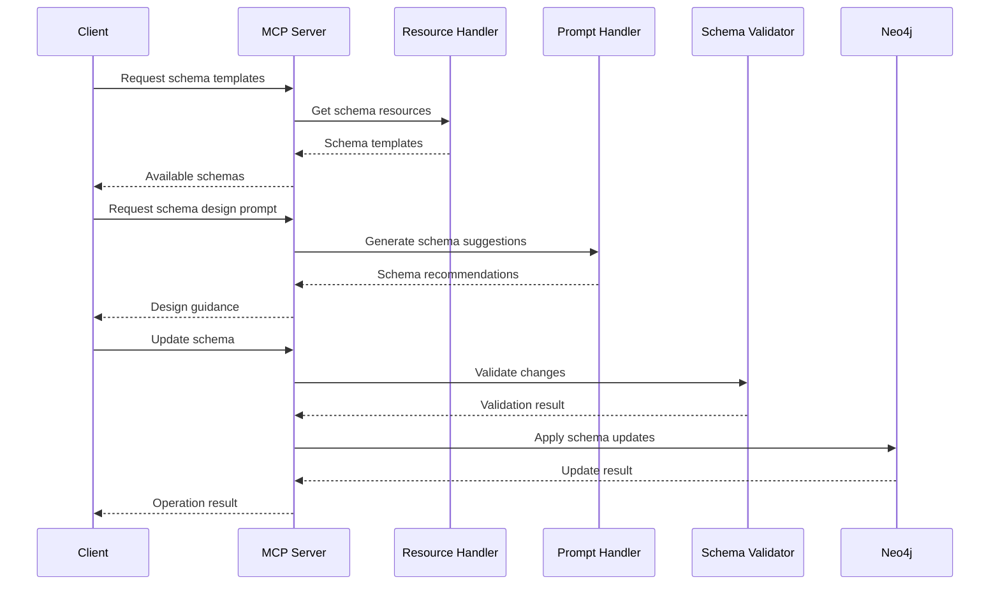

# Neo4j MCP Server Workflow

## Overview

The Neo4j MCP Server provides a Model Context Protocol interface for interacting with a Neo4j database. It exposes three main types of functionality:
1. Resource Discovery and Access
2. Prompt-Based Assistance
3. Tool Execution

## Core Components

### Resources
- **Purpose**: Provide discoverable information about available templates, schemas, and database structure
- **Entry Points**: 
  - `handle_list_resources()`: Lists available resources
  - `read_resource()`: Retrieves specific resource content
- **URIs**:
  ```
  neo4j://templates/queries     # Query templates
  neo4j://templates/schemas     # Schema templates
  neo4j://schema/nodes         # Current database node structure
  neo4j://schema/relationships # Current relationship types
  neo4j://schema/indexes      # Current indexes
  ```

### Prompts
- **Purpose**: Guide users in constructing queries and designing schemas
- **Entry Points**:
  - `handle_list_prompts()`: Lists available prompts
  - `handle_get_prompt()`: Generates context-specific prompts
- **Types**:
  ```
  query-suggestion    # Help choosing query templates
  schema-design      # Schema design guidance
  query-optimization # Query performance advice
  ```

### Tools
- **Purpose**: Execute operations on the Neo4j database
- **Entry Points**:
  - `handle_list_tools()`: Lists available tools
  - `handle_call_tool()`: Executes specified tool
- **Operations**:
  ```
  execute-template   # Run predefined query templates
  custom-query      # Execute custom Cypher queries
  schema-update     # Modify database schema
  ```

## Workflow Sequences

### 1. Template-Based Query Execution



### 2. Schema Management



## Data Flow

1. **Resource Discovery**
   ```
   Client -> list_resources() -> Resource Definitions -> Client
   Client -> read_resource(uri) -> Resource Content -> Client
   ```

2. **Template Usage**
   ```
   Client -> get_prompt("query-suggestion") -> Template Recommendations
   Client -> call_tool("execute-template") -> Template Validation -> Query Execution -> Results
   ```

3. **Schema Management**
   ```
   Client -> get_prompt("schema-design") -> Schema Recommendations
   Client -> call_tool("schema-update") -> Schema Validation -> Database Update -> Results
   ```

## Key Integration Points

### MCP Protocol Handlers
```python
@server.list_resources()
async def handle_list_resources() -> list[Resource]:
    # Returns available Neo4j resources

@server.read_resource()
async def read_resource(uri: AnyUrl) -> str | bytes:
    # Retrieves specific resource content

@server.list_prompts()
async def handle_list_prompts() -> list[Prompt]:
    # Returns available prompts

@server.get_prompt()
async def handle_get_prompt(name: str, arguments: dict) -> GetPromptResult:
    # Generates contextual prompts

@server.list_tools()
async def handle_list_tools() -> list[Tool]:
    # Returns available tools

@server.call_tool()
async def handle_call_tool(name: str, arguments: dict) -> list[TextContent]:
    # Executes requested tool
```

## Error Handling

1. **Validation Errors**
   - Schema compatibility checks
   - Parameter validation
   - Template constraints

2. **Execution Errors**
   - Database connection issues
   - Query execution failures
   - Resource access problems

3. **Response Formatting**
   - Error standardization
   - Result formatting
   - Warning aggregation

## Best Practices

1. **Template Usage**
   - Validate parameters before execution
   - Check schema compatibility
   - Use transaction management
   - Include execution metrics

2. **Schema Management**
   - Validate changes before applying
   - Maintain backwards compatibility
   - Document schema updates
   - Include rollback procedures

3. **Resource Management**
   - Cache frequently accessed resources
   - Validate URIs before access
   - Handle missing resources gracefully
   - Version resources appropriately